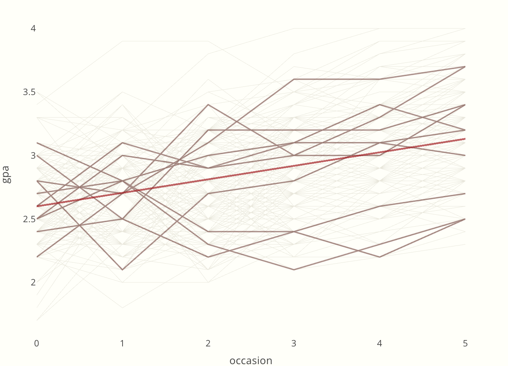

source https://m-clark.github.io/mixed-models-with-R/random_intercepts.html

Mixed models, also known as multilevel or hierarchical models, are powerful statistical tools used to analyze data that is grouped or organized in levels, such as students within schools or repeated measurements within a single patient. By combining both fixed and random effects, these models provide a flexible framework for handling complex data structures that traditional linear regression cannot.

### **Understanding the "Mixed" in Mixed Models**

The term "mixed" refers to the combination of two distinct types of effects:
 
**Fixed Effects:** These are constant parameters we aim to estimate directly. They represent the population-level influence of independent variables, such as the overall average effect of a drug treatment.

**Random Effects:** These are treated as random variables representing variation at different levels. Instead of estimating a specific value for each group (like a specific patient), we estimate the parameters of their distribution, such as the variance between patients.

### **Why are Mixed Models Useful?**

#### **1. Handling Correlated Data**

Standard linear regression assumes that all observations are independent. However, in real-world data, observations within the same group—such as test scores of children in the same classroom—are often correlated. Mixed models explicitly account for this "intra-class correlation" by adding random effects, which prevents underestimating standard errors and making incorrect statistical inferences.

#### **2. Powering Longitudinal Research**

In longitudinal studies, the same individual is measured repeatedly over time. Mixed models are ideal here because they can handle:

**Varying time points:** They don't require every participant to be measured at the exact same intervals.

**Missing data:** Unlike some older methods, mixed models can still utilize data from individuals who missed a measurement session.

**Individual trajectories:** By using **random intercepts** and **random slopes**, we can model how each person starts at a different baseline and changes at a different rate over time.

#### **3. Generalizing to the Wider Population**

Because random effects view the groups in your data (like specific hospitals or schools) as a random sample from a larger population, mixed models allow you to make broader generalizations. You aren't just concluding something about the 10 schools in your study; you are making an inference about schools in general.

