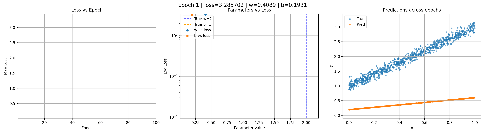

Deep learning is often treated as a black box: a model is trained, a loss curve is inspected, and if the number goes down, the result is considered successful. While this workflow is common, it hides the actual learning process that takes place during training. **Learning is not a single outcome but a trajectory that unfolds over epochs**, shaped by optimization, parameter updates, and changing predictions. To truly understand what a neural network is doing, we need to observe learning as it happens rather than only at the end.

To make this process visible, I train a minimal feedforward neural network on a deliberately simple problem: **learning a noisy linear function of the form: y = 2 * x + 1 + ϵ**. 

## The Model
The model consists of a single fully connected layer with one input and one output, using a linear activation. This architecture contains exactly **two trainable parameters**: one weight and one bias. The weight controls the slope, while the bias controls its vertical offset. 

Note: From the function generating the data, w = 2 and b = 1

## Learning Curve
The first perspective on learning comes from plotting the training loss as a function of epochs. This graph answers the most basic question: is the model learning at all? In early epochs, the loss typically drops rapidly, indicating that the optimizer has found a direction that significantly reduces error. As training progresses, the curve flattens, reflecting smaller and more precise updates near the optimum. While this curve is useful for diagnosing convergence and stability, it remains purely diagnostic. It tells us that learning is happening, but not how or why.

## Paramaters Trajectory 
To understand how learning happens, we examine the relationship between model parameters and loss. By plotting the weight and bias values against the corresponding loss at each epoch, optimization becomes a clear process rather than an abstract algorithm. Each point represents a snapshot of the model’s state in parameter space. Early in training, both parameters are far from their true values and the loss is high. As epochs progress, the weight approaches the true slope of two and the bias approaches the true intercept of one, while the loss decreases accordingly. Using a logarithmic scale for loss reveals the structure of early optimization, where large improvements occur rapidly before slowing down near convergence. 

## Actual Vs Prediction
The final and most intuitive perspective comes from visualizing predictions over the data. At each epoch, the model’s predictions are plotted alongside the true data points. Early in training, predictions appear poorly aligned and almost arbitrary. As learning progresses, a structure begins to emerge: the slope becomes visible, the intercept stabilizes, and eventually the predictions collapse onto a clean linear relationship that matches the data-generating process. This visualization bridges the gap between abstract optimization and concrete behavior. It shows that the model is not learning parameters in isolation, but learning a function defined by just two numbers.

Taken together, these three views provide a complete picture of learning dynamics. The loss curve confirms that learning is occurring, the parameter-versus-loss plot explains how optimization proceeds, and the prediction plot reveals what the model has actually learned at each stage. The fact that all of this behavior is governed by only two trainable parameters highlights how even the simplest neural network exhibits the same learning mechanics as much larger models.
